# 🌳 AirBuddy Madrid

A gamified environmental awareness app that connects air quality, respiratory health, and urban green spaces in Madrid through a virtual tree avatar that lives or wilts with the city.


---

## Workspace

Github:

* Repository: https://github.com/Giorgos453/KotlinProject
* Releases: https://github.com/Giorgos453/KotlinProject/releases

Workspace: https://upm365.sharepoint.com/sites/KotlinProject

---

## Table of Contents

1. [About the Project](#about-the-project)
2. [The Climate Cube Concept](#the-climate-cube-concept)
3. [Features](#features)
4. [Screenshots](#screenshots)
5. [Tech Stack](#tech-stack)
6. [APIs Used](#apis-used)
7. [How to Use](#how-to-use)
8. [Demo Video](#demo-video)
9. [Project Structure](#project-structure)
10. [Game Mechanics](#game-mechanics)
11. [Authors](#authors)
12. [Acknowledgments](#acknowledgments)

---

## About the Project

**AirBuddy Madrid** is a gamified environmental awareness app where users care for a virtual tree avatar that reacts to real-time air quality data in Madrid. The cleaner the city's air, the healthier the tree. When pollution rises, the tree wilts — turning an invisible environmental problem into an immediate, personal stake.

The core gameplay loop is simple: **bad air quality drains your tree, your actions heal it.** Daily logins, eco-quizzes, and check-ins at real Madrid parks all reward XP that grows the avatar through five distinct life stages, from a wilted seedling to a healthy, full-grown tree.

The app was built for the **Mobile App Development course** at **Universidad Politécnica de Madrid (UPM)**, taught by **Prof. Bernardo Tabuenca**. It follows the **Climate Cube Game** framework, which teaches students to design experiences that connect environmental problems, their human impact, and concrete solutions in a single coherent story.

Unlike generic air-quality apps that simply display numbers, AirBuddy Madrid translates abstract pollution data into emotional stakes (your tree's wellbeing), educational content (the eco quiz), and real-world action (visiting Madrid's green spaces).

---

## The Climate Cube Concept

AirBuddy implements all three Climate Cube dimensions in a single, integrated experience:

### 🔴 RED — Air Quality (The Problem)
- Real-time air quality data from the **Open-Meteo CAMS Europe API**
- **European AQI** with full pollutant breakdown (PM2.5, PM10, NO₂, O₃, SO₂)
- Interactive **daily trend chart** showing hourly AQI changes
- Location-based readings via GPS, with a Madrid fallback when no signal is available

### 🟡 YELLOW — Respiratory Health (The Impact)
- Health advice **dynamically generated** from the current AQI level
- Quiz questions about the health effects of urban pollution
- Tree avatar **drains XP automatically** when air quality is poor
- Educational content explaining how each pollutant affects the human body

### 🟢 GREEN — Trees & Parks (The Solution)
- Interactive map with **10 real Madrid parks** as discoverable locations
- Park **check-in system** rewarding users with XP for visiting green spaces
- Tree avatar that **grows** through environmental awareness actions
- Educational quiz covering urban greening, tree benefits, and sustainable habits

---

## Features

### 🌱 Core Features
- **Tree Avatar System** — virtual companion with 5 growth stages (Wilted, Seed, Sprout, Young Tree, Healthy Tree)
- **XP System** — unlimited progression with stage-based milestones
- **Daily Login Streak** — escalating bonus rewards for consecutive logins
- **Air Quality Monitor** — real-time European AQI, pollutant breakdown, and an interactive hourly chart
- **Weather Integration** — current conditions and 5-day forecast via OpenWeatherMap
- **Eco Quiz** — 50 questions across the 3 Climate Cube categories with a daily play limit
- **Park Discovery** — 10 Madrid parks on the map, each rewarding a one-time check-in bonus
- **Leaderboard** — live Firebase-synced global ranking by XP

### 👤 Account & Profile
- **Firebase Authentication** (Email/Password + Google Sign-In)
- Customizable profile with **tree-themed avatar selection**
- **Username management**
- **GPS location tracking** with live map updates

### 📚 Educational
- **"How AirBuddy Works"** guide explaining the Climate Cube concept, game mechanics, and app philosophy
- **Quiz explanations** after each answer, teaching environmental facts
- **Health advice** based on the current air quality conditions

---

## Screenshots

### 🏠 Home Screen
The main hub: tree avatar status, XP and streak stats, and quick-access tiles to every feature.

<p align="center">
  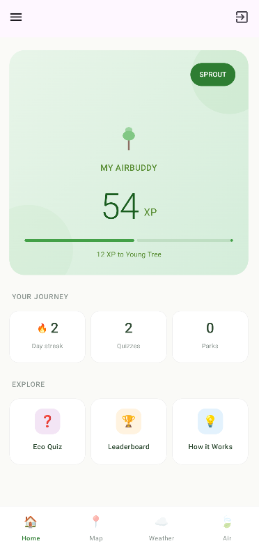
  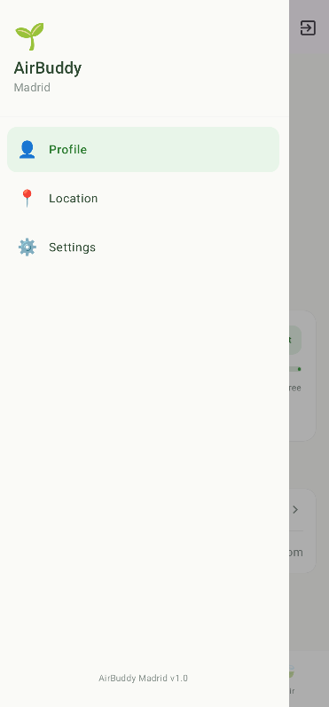
</p>
<p align="center"><i>Home screen with tree avatar, XP and streak stats &nbsp;|&nbsp; Side navigation drawer for quick access to all features</i></p>

### 🌳 My AirBuddy (Tree Detail)
Tap the tree avatar to see its current stage, past growth journey and what's coming next.

<p align="center">
  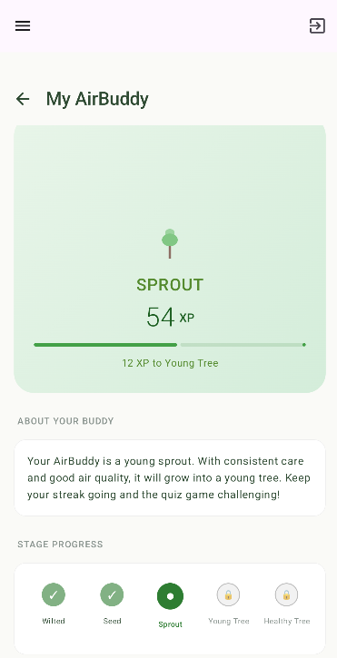
  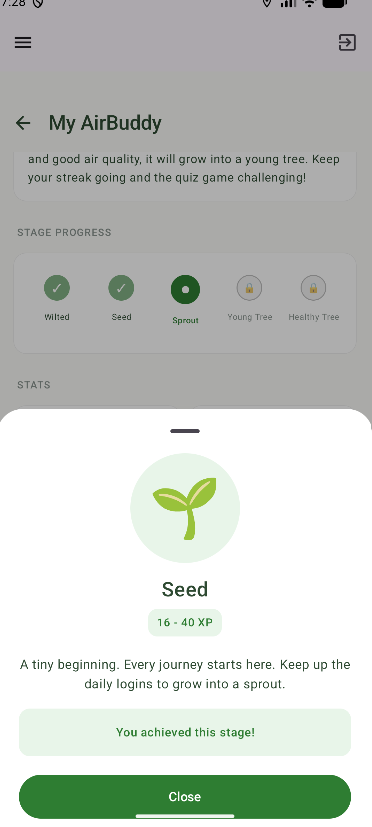
</p>
<p align="center"><i>Current tree state with score and stage info &nbsp;|&nbsp; Past stages already unlocked by the user</i></p>

<p align="center">
  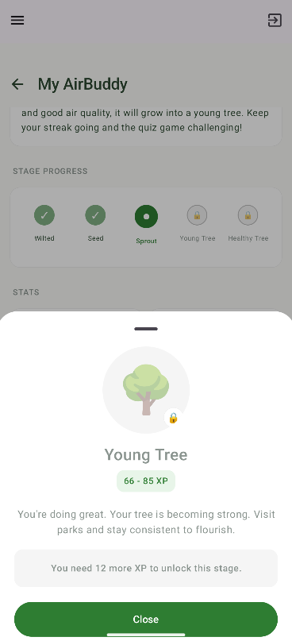
</p>
<p align="center"><i>Upcoming stages — a roadmap of what your tree can still become</i></p>

### 💨 Air Quality
Real-time European AQI for Madrid with a complete pollutant breakdown and an hourly trend chart.

<p align="center">
  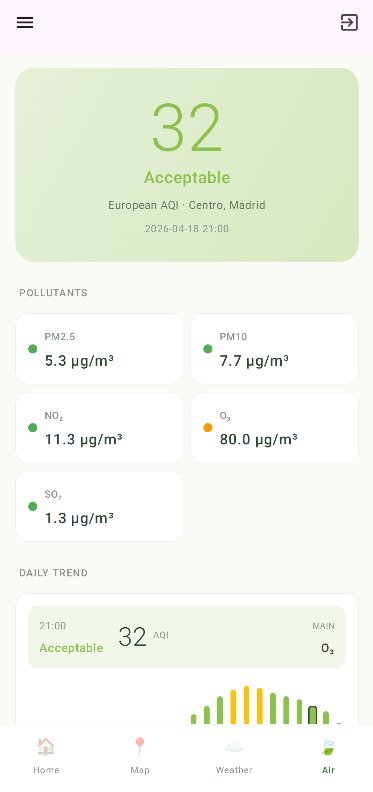
  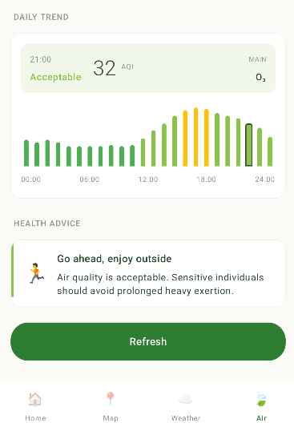
</p>
<p align="center"><i>AQI overview with current level and category &nbsp;|&nbsp; Scrolled view showing pollutants and the daily trend chart</i></p>

<p align="center">
  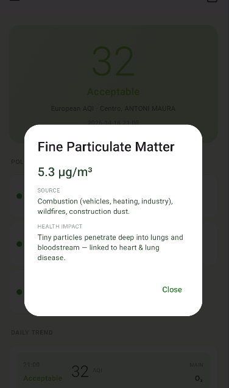
</p>
<p align="center"><i>Tap any pollutant for a detailed health-impact explanation</i></p>

### 🌦️ Weather
Current conditions and a 5-day forecast for the user's location, powered by OpenWeatherMap.

<p align="center">
  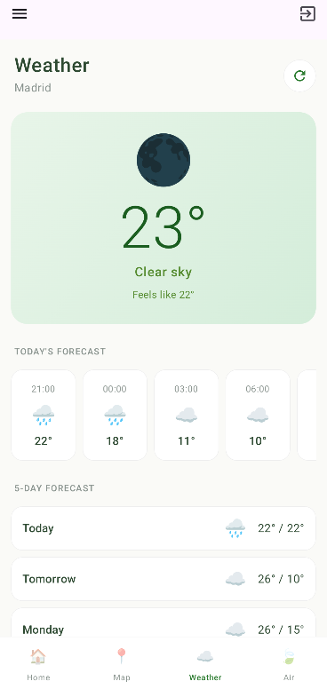
  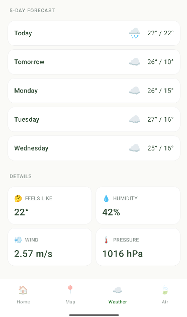
</p>
<p align="center"><i>Current weather with temperature and conditions &nbsp;|&nbsp; Hourly and 5-day forecast view</i></p>

<p align="center">
  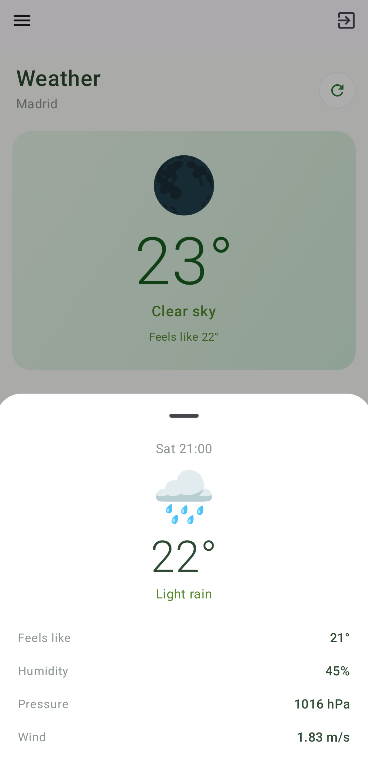
</p>
<p align="center"><i>Detailed view for a selected forecast entry</i></p>

### 🗺️ Map & Park Discovery
Interactive map of Madrid showing all 10 discoverable parks and the user's live location.

<p align="center">
  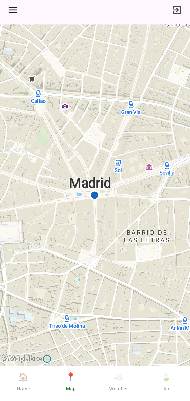
</p>
<p align="center"><i>Madrid map with the 10 park check-in locations and live user position</i></p>

### 🧠 Eco Quiz
50 questions across the three Climate Cube categories — one scored session per day.

<p align="center">
  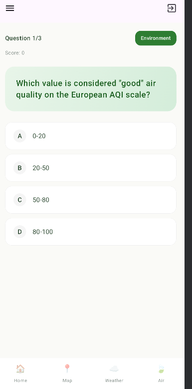
  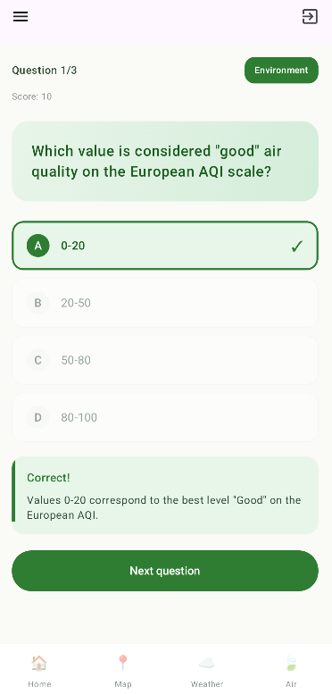
</p>
<p align="center"><i>Quiz question with multiple-choice answers &nbsp;|&nbsp; Feedback after a correct answer with an explanation</i></p>

<p align="center">
  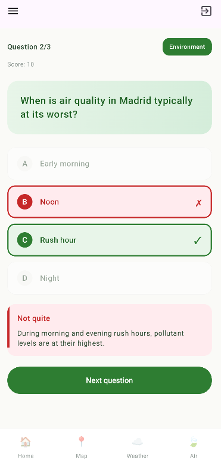
  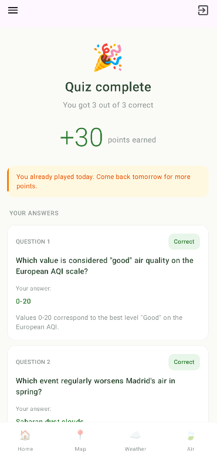
</p>
<p align="center"><i>Feedback after a wrong answer, including the correct one &nbsp;|&nbsp; End-of-quiz summary with score and XP earned</i></p>

### 🏆 Leaderboard
Live, Firebase-synced global ranking ordered by total XP.

<p align="center">
  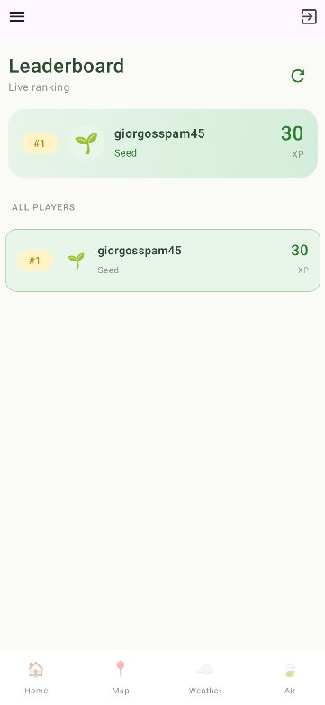
</p>
<p align="center"><i>Global leaderboard ranking all users by their AirBuddy XP</i></p>

### 🪪 Profile
Manage your username and choose a tree-themed avatar.

<p align="center">
  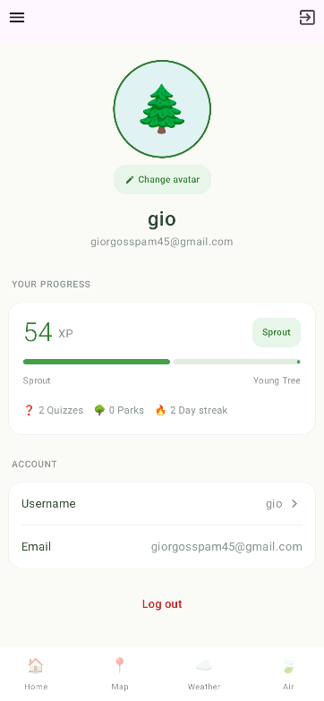
  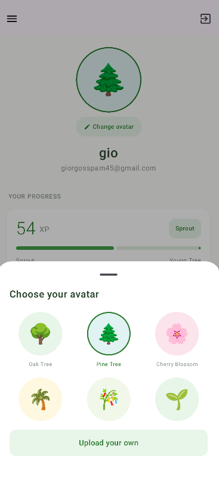
</p>
<p align="center"><i>Profile screen with personal stats and account info &nbsp;|&nbsp; Tree-themed avatar picker</i></p>

### ❓ How AirBuddy Works
In-app guide explaining the Climate Cube framework and the game's mechanics.

<p align="center">
  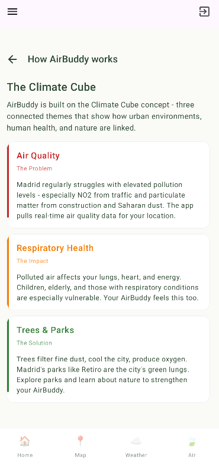
  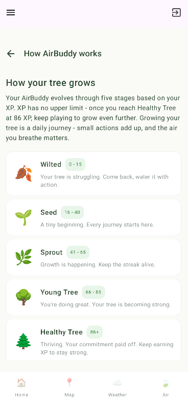
</p>
<p align="center"><i>Climate Cube concept explained inside the app &nbsp;|&nbsp; Walkthrough of how the tree grows and wilts</i></p>

<p align="center">
  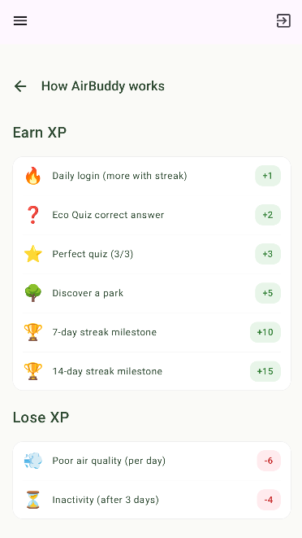
</p>
<p align="center"><i>Detailed breakdown of how XP is earned and lost</i></p>

---

## Tech Stack

| Layer | Technology |
|---|---|
| Language | **Kotlin** |
| UI | **Jetpack Compose** + XML (hybrid) |
| Architecture | **MVVM** with Repository Pattern |
| Local Database | **Room** (SQLite) |
| Remote Database | **Firebase Realtime Database** |
| Authentication | **Firebase Auth** (Email/Password + Google Sign-In via Credential Manager) |
| Networking | **Retrofit** + OkHttp + Gson |
| Image Loading | **Glide** (with Compose integration) |
| Maps | **MapLibre Android SDK** (with MapTiler styles) |
| Location | **Google Play Services FusedLocationProvider** |
| Permissions (Compose) | **Accompanist Permissions** |
| Secure Storage | **EncryptedSharedPreferences** (AndroidX Security) |
| Min SDK | **26** (Android 8.0 Oreo) |
| Target SDK | **36** |

---

## APIs Used

- **Open-Meteo Air Quality API** — free, no API key required. Provides real-time European AQI, individual pollutant concentrations and hourly forecasts (powered by Copernicus CAMS Europe).
- **OpenWeatherMap API** — free tier, API key required. Used for current weather and the 5-day forecast.
- **MapTiler / OpenStreetMap** — vector map tiles rendered through MapLibre.
- **Firebase Realtime Database** — synchronizes user profiles, XP scores and the global leaderboard.
- **Firebase Authentication** — email/password and Google Sign-In account management.

---

## How to Use

### Prerequisites
- Android Studio (latest stable release)
- Android device or emulator running **API 26+**
- A Google account (for Firebase Auth)

### Setup
1. **Clone** the repository:
   ```bash
   git clone https://github.com/Giorgos453/KotlinProject.git
   ```
2. **Open** the project in Android Studio.
3. Create a Firebase project at [console.firebase.google.com](https://console.firebase.google.com).
4. Download `google-services.json` and place it inside the `app/` folder.
5. In the Firebase Console, **enable Authentication** with both *Email/Password* and *Google* providers.
6. **Enable Realtime Database** in the Firebase Console (test mode is fine for development).
7. Create a free OpenWeatherMap account at [openweathermap.org](https://openweathermap.org/) and copy your default API key.
8. **Build and run** the app from Android Studio.
9. On first launch, **register** with email or sign in with Google.
10. Open **Settings** from the side menu and **paste your OpenWeatherMap API key**.
11. **Grant the location permission** when prompted (required for GPS-based weather and the map).

### Notes
- Air quality data works **immediately** without any API key — Open-Meteo is free and keyless.
- Weather requires the OpenWeatherMap key to be configured in Settings.
- New OpenWeatherMap API keys can take **10–30 minutes** to activate after creation.
- For emulator testing, set the location to Madrid (`40.4165, -3.7026`) via *Extended Controls → Location*.

---

## Demo Video

[Watch the 60-second demo video here](LINK_TO_BE_ADDED)

*60-second walkthrough showcasing the core features of AirBuddy Madrid.*

---

## Project Structure

```
app/src/main/java/com/example/myapplication/
├── data/                # Repositories, data sources, API services, Room entities
│   ├── airbuddy/        # Tree state, XP scoring, Madrid parks
│   ├── airquality/      # Open-Meteo API client and models
│   ├── database/        # Room entities, DAOs and AppDatabase
│   ├── firebase/        # Firebase Auth and Realtime Database adapters
│   ├── leaderboard/     # Leaderboard sync logic
│   ├── location/        # FusedLocation wrapper
│   ├── map/             # Map markers and styles
│   ├── network/         # Retrofit + OkHttp setup
│   ├── preferences/     # PreferencesManager
│   ├── profile/         # User profile data source
│   ├── quiz/            # Quiz questions, DAO, repository
│   └── security/        # Encrypted API key storage
├── ui/                  # Compose screens, ViewModels, UI states
│   ├── airbuddy/        # Air quality + avatar UI
│   ├── home/            # Home, Tree Detail, How It Works
│   ├── leaderboard/     # Leaderboard screen
│   ├── location/        # GPS log screen
│   ├── map/             # Madrid parks map
│   ├── profile/         # Profile + avatar picker
│   ├── quiz/            # Quiz and summary screens
│   ├── settings/        # Settings (API key, preferences)
│   └── weather/         # Current weather + forecast
├── navigation/          # Type-safe Compose NavHost
├── util/                # Shared utilities (logging, formatters)
├── LoginActivity.kt     # Launcher activity (auth)
├── MainActivity.kt      # Hub with bottom navigation + drawer
├── SecondActivity.kt    # GPS coordinate log (legacy)
└── ThirdActivity.kt     # GPS detail screen (legacy)
```

---

## Game Mechanics

### Earning XP

| Action | XP Reward |
|---|---|
| Daily login (base) | **+1** (scales with streak length, up to +4/day) |
| Quiz: each correct answer | **+2** |
| Quiz: perfect 3/3 bonus | **+3** |
| Park check-in (one-time per park) | **+5** |
| 7-day streak milestone | **+10** |
| 14-day streak milestone | **+15** |
| 30-day streak milestone | **+25** |

### Losing XP

| Trigger | XP Penalty |
|---|---|
| Poor air quality (daily, scaled by AQI) | up to **−8** per day |
| Inactivity (4+ days without login) | **−4** per day, capped at **−20** |

### Tree Stages

| Stage | XP Range |
|---|---|
| 🥀 Wilted | 0 – 15 |
| 🌱 Seed | 16 – 40 |
| 🌿 Sprout | 41 – 65 |
| 🌳 Young Tree | 66 – 85 |
| 🌲 Healthy Tree | 86+ (no upper limit) |

> **Daily quiz limit:** only one quiz session per day awards XP — this prevents farming and keeps engagement honest.

---

## Authors

- [Giorgos Galatidis](https://github.com/Giorgos453) — giorgos.galatidis@alumnos.upm.es
- [Murat Kockar](https://github.com/username2) — murat.kockar@alumnos.upm.es

**Universidad Politécnica de Madrid** — Mobile App Development Course
**Professor:** Bernardo Tabuenca

Workload distribution between members: **50% / 50%**.

---

## Acknowledgments

- **Air quality data:** [Open-Meteo](https://open-meteo.com/) — CAMS European air quality forecasts (Copernicus Atmosphere Monitoring Service)
- **Weather data:** [OpenWeatherMap](https://openweathermap.org/)
- **Map data:** [OpenStreetMap](https://www.openstreetmap.org/) contributors, rendered via [MapLibre](https://maplibre.org/) and [MapTiler](https://www.maptiler.com/)
- **Course framework:** *Climate Cube Game* concept by Prof. Bernardo Tabuenca
